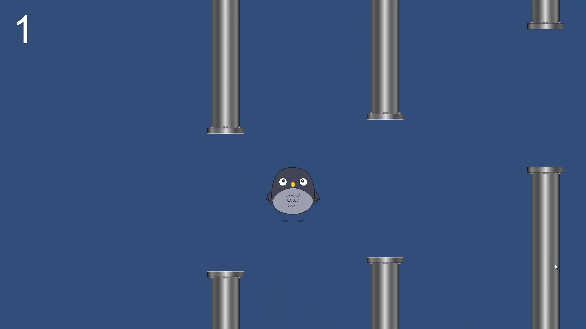
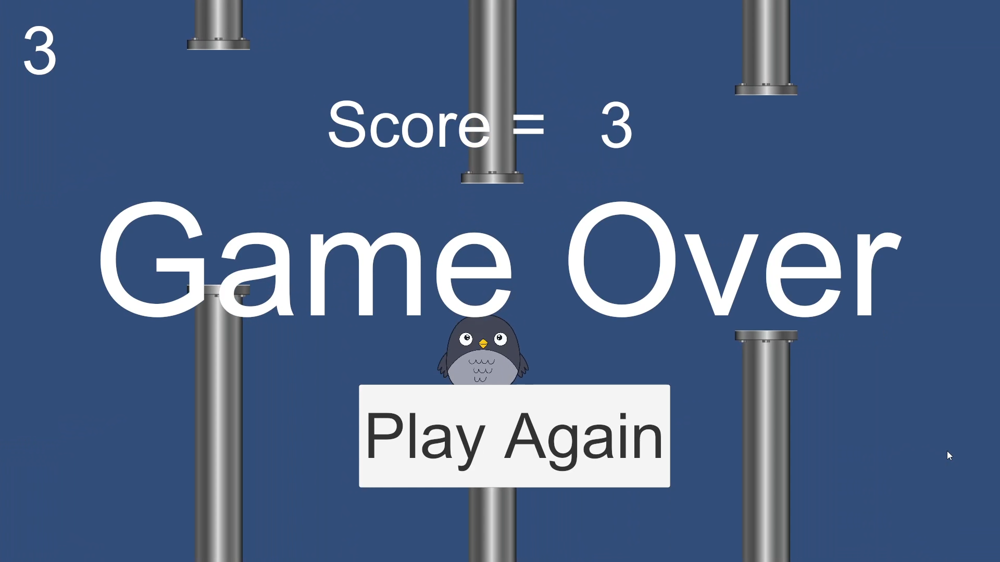
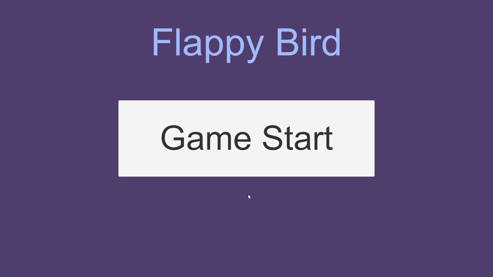
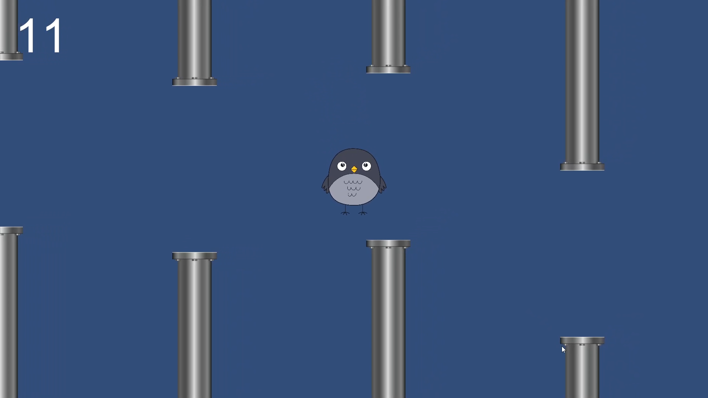

## Flappy Bird

The game is a side-scrolling arcade experience where the player controls a bird. The objective is to fly the bird through a series of pipes without hitting them or the ground. A single tap or button press makes the bird flap its wings, giving it a small upward thrust, while gravity continuously pulls it down.

# My Project
Here is a screenshot:

# The game features:

- 🏁 Start screen with a **3-2-1 countdown**
- 🐥 Tap/click/space to make the bird flap
- 📱 Touch input support (for mobile builds)
- ⌨️ Keyboard support (`Space` or mouse click)
- 🎵 Sound effects: flap, start, coin, death
- 🧠 Score system with final score display
- 💀 Game Over screen with dead bird sprite
- 🔁 Restartable via Game Over UI
- 🧩 Modular code (GameManager, Logic, Bird)

Simple, Addictive Mechanics: The core gameplay loop of flapping to avoid obstacles is easy to learn but difficult to master.

Procedurally Generated Pipes: The pipes are created randomly, ensuring a new and challenging experience with each playthrough.

Collision Detection: The game accurately detects collisions between the bird and the pipes or the ground, ending the game on impact.

Scoring System: A score is awarded for each pair of pipes the bird successfully navigates through.

# Technologies Used

- Unity Engine (Tested on Unity 2021.3+)
- C# scripts
- Unity UI system (Canvas, Text)
- AudioSource components

Unity Game Engine: The entire project is built using Unity, specifically with the 2D workflow.

C#: All game logic and scripts are written in C#.

# 🎮 Controls

| Action              | Input                      |
|---------------------|----------------------------|
| Flap (jump)         | Touch / Mouse Click / Space |
| Start Game          | Start Button on UI         |
| Restart Game        | Game Over screen button    |

# Getting Started
To run this project on your local machine, you will need a compatible version of the Unity engine.

# Download as zip or Download Release for play

To get the Unity files Mail me to fahimsadik9@gmail.com
